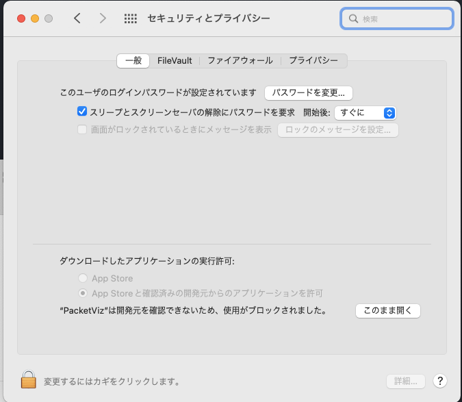

# 以下のURLからダウンロード
https://github.com/PacketViz/Release/releases/download/mac/PacketViz

## macのエラー
macの場合以下のようなエラーが出ることがあります。

その場合、システム環境設定の「セキュリティとプライバシー」を開いて、「このまま開く」ボタンを押していただくと、開くことができます。

## ダークモード非対応
macのダークモードには非対応なので、ライトモードにしてお使いください。
